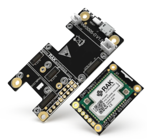

# RAKWireless WisBlock


The WisBlock Starter Kit is just one of a line of products offered by RAKWireless. The starter kit is just that, a base developer board that can 
have multiple combinations of expansion boards added to it. The full WisBlock offering can be seen [here](https://store.rakwireless.com/pages/wisblock).

## Introduction

Here you will find one or more sample PlatformIO embedded projects designed to transmit LoRaWAN packets using a [WisBlock Starter Kit](https://store.rakwireless.com/products/wisblock-starter-kit).

## Resources
[Product Page](https://store.rakwireless.com/products/wisblock-starter-kit)  
[Manual](https://docs.rakwireless.com/Product-Categories/WisBlock/)  
[US Retailer - Parley Labs](https://shop.parleylabs.com)

## Firmware examples 
* [LoRaWan_OTAA](examples/LoRaWan_OTAA/)


### Software
The following products are required. Refer to the [Getting started with Helium and PlatformIO](../getting-started.md) guide for details.

* [VSCode \(IDE)](https://code.visualstudio.com/)
    * [PlatformIO \(VScode Extension)](https://platformio.org/)
* [Helium Console](https://www.helium.com/console) 

### WisBlock Special Instructions
#### Antenna Type/location
The WisBlock starter kit comes with two antenna types, 
* the one that resembles an "I" is the LoRa antenna, this one connects to the connector on the core module marked LoRa, which is below the large K in the RAK logo.
* the one that resembles a "T" is the BLE antenna, this one connects to the connector on the core module marked BLE

 #### Software
The WisBlock is not currently supported by PlatformIO out of the box. One must install VSCode/PlatformIO and then take some extra steps to add support for WisBlock.

The Helium [Getting started with Helium and PlatformIO](../getting-started.md) can be used as a reference after one has installed the necessary PlatformIO pieces and parts detailed
within the RAKWireless guide.

The RAKWireless getting started guide will walk you through the steps required to build a WizBlock embedded app with PlatformIO. It can be found at
[https://github.com/RAKWireless/WisBlock/blob/master/doc/Quick_Start/README.md#installation-of-board-support-package-in-platformio](https://github.com/RAKWireless/WisBlock/blob/master/doc/Quick_Start/README.md#installation-of-board-support-package-in-platformio)

The guide will walk you through the following basic steps to get a simple Helium enabled embedded application up and running. We have included a sample PlatformIO project along side this README. However, be sure to follow the RAKWireless guide as there are a few mandatory customizations that must be applied to the PlatformIO installation in order to support the WisBlock.
 The basic steps will include
 * install VSCode
 * install the VSCode extension PlatformIO
 * install the Nordic nRF52 Arduino framework
 * add RAK WisBlock support files to the platform and packages locations
 * create a new PlatformIO project
 * integrate sample Rak WisBlock project code
 * integrate your device specific Helium network configuration keys, Device EUI, APPEUI, APPKEY which 
you obtain from the Helium console device definition.
 * add a project dependency library, SX126x-Arduino 
 * add your target LoRaWAN region define to the platformio.ini configuration file
 * compile and upload

```

NOTE: the quick start guide was not written targeting a LoRaWAN sample application. Thus it does "not"
point out the required device credential update. Refer to the "OTAA Keys" note within the main.cpp file.

NOTE: An upload to the WisBlock board may error out if there is an open connection between the WisBlock
developer board and the debug terminal emulator. If this is the case, close down the terminal emulator
and retry the upload.
```

Other RAKWireless sample code can be found [https://github.com/RAKWireless/WisBlock/tree/master/examples](https://github.com/RAKWireless/WisBlock/tree/master/examples)
